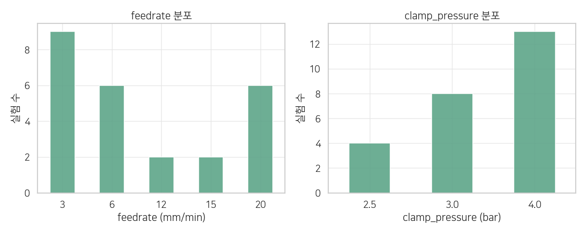
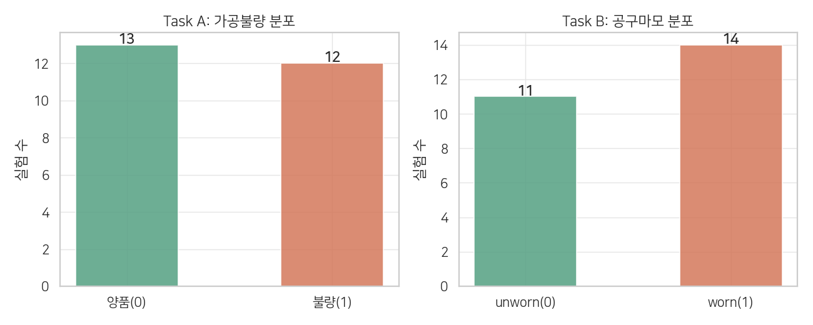
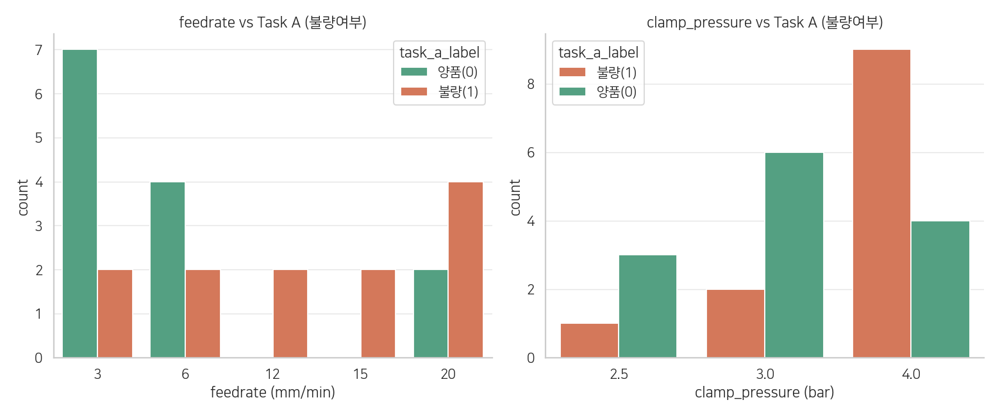
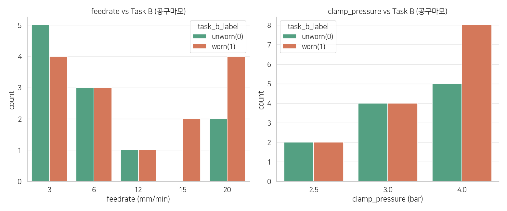
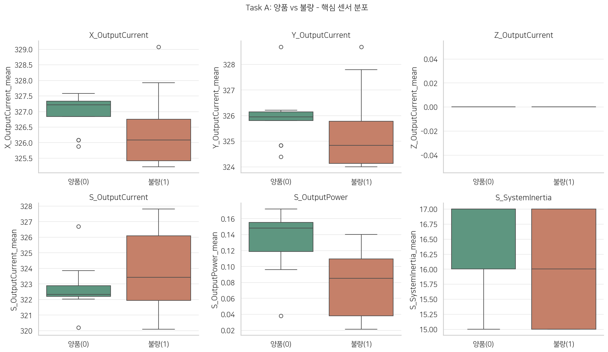
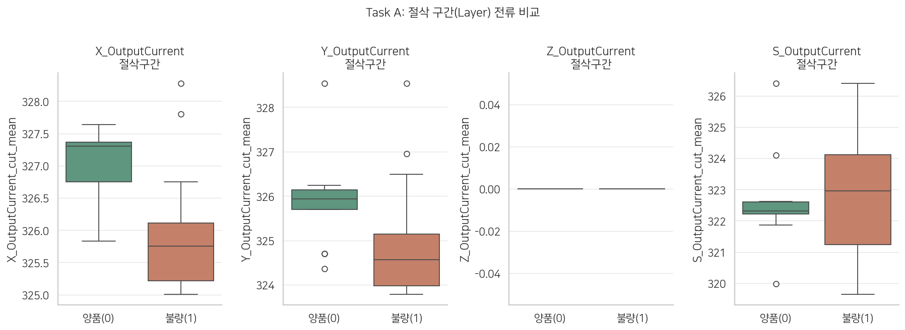
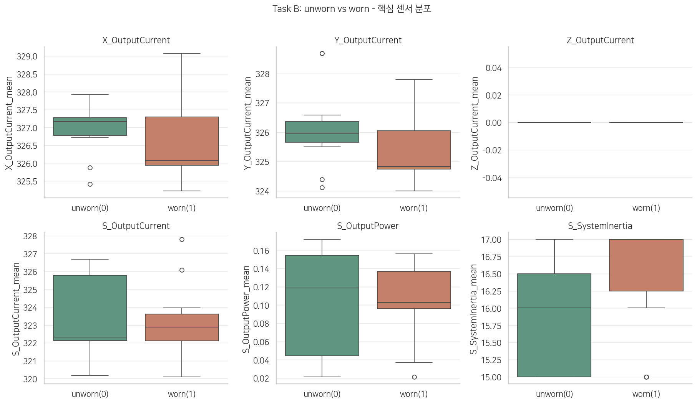
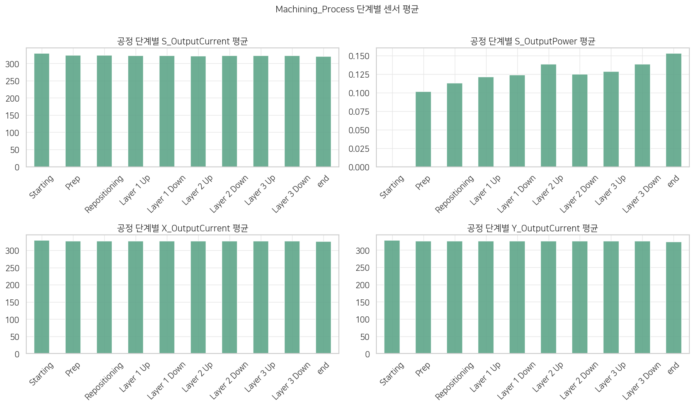
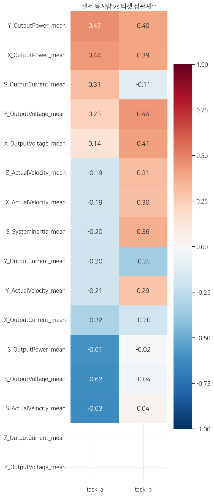

# EDA 분석 보고서

작성일: 2026-06-26
작성자: 분석 대화 기반 (Claude + 사용자)
참조 스크립트: `src/eda.py`
참조 피규어: `reports/figures/`

---

## 1. 데이터 성격 확인

### 이 데이터는 실험 설계(DOE) 데이터다

`train.csv`의 feedrate와 clamp_pressure를 보면 연속값이 아닌 사전에 정해진 이산 레벨이다.

- feedrate: 3, 6, 12, 15, 20 mm/min
- clamp_pressure: 2.5, 3.0, 4.0 bar
- material: 전 실험 aluminum으로 고정

이는 실제 생산 현장 데이터가 아니라 **University of Michigan SMART Lab에서 조건을 의도적으로 바꿔가며 진행한 통제 실험**이다. KAMP에서 재공개한 버전으로 추정.

**모델링 시 함의:**
- 학습 데이터의 피처 분포가 실제 현장과 다를 수 있음
- 모델이 특정 feedrate/clamp_pressure 조합에만 최적화될 위험 존재
- 현장 이식 시 재학습 또는 도메인 적응 필요

---

## 2. 타겟 분포 (그림 01)

### 실험 수 기준 vs 실제 데이터 행 수 기준

실험 개수만 보면 거의 반반처럼 보이지만, **실제 센서 데이터 행 수는 다르다.**

| | 실험 수 | 총 행 수 | 비율 |
|--|--|--|--|
| Task A 양품(0) | 13 | 22,645 | 70.7% |
| Task A 불량(1) | 12 | 9,403 | 29.3% |
| Task B unworn(0) | 11 | 16,583 | 51.7% |
| Task B worn(1) | 14 | 15,465 | 48.3% |

**해석:**
- Task A 불량 실험의 평균 행 수가 783행으로, 양품(1,741행)의 절반 이하
- 불량 실험은 가공이 중단되거나 일찍 끝나는 경우가 많아 데이터가 짧게 끊김
- **실험 행 수(row_count) 자체가 Task A 피처 후보** → 전처리 시 실험별 집계에 `row_count` 컬럼 추가 검토 (Task A 한정, Task B에는 해당 없음)
- Task B는 행 수 기준으로도 균등 → 공구 마모는 가공 완료 여부와 무관하게 진행됨
- 실제 제조 현장에서 불량률은 훨씬 낮음. 이 데이터의 반반 비율은 실험 설계의 산물

---

## 3. 피처 vs Task A 불량여부 (그림 03)

### feedrate: 명확한 경향 존재

불량률 기준으로 보면:

| feedrate | 불량률 |
|--|--|
| 3 mm/min | 22% |
| 6 mm/min | 33% |
| 20 mm/min | 67% |
| 12 mm/min | 100% |
| 15 mm/min | 100% |

이송속도가 빠를수록 절삭력과 열이 커져 불량률이 높아지는 경향이 뚜렷하다. 다만 12/15 mm/min은 실험이 각 2개뿐이고 모두 4.0 bar에서만 진행되어 **독립적 해석 불가**.

### clamp_pressure: 독립 효과 확인됨

| clamp_pressure | 불량률 |
|--|--|
| 2.5 bar | 25% |
| 3.0 bar | 25% |
| 4.0 bar | 69% |

단순히 4.0 bar 실험이 많아서가 아님. feedrate를 통제해도 4.0 bar에서 불량률이 높다.

- feedrate=3: 저압(2.5/3.0 bar) → **불량 0%** vs 4.0 bar → **50%**
- feedrate=6: 저압 → **25%** vs 4.0 bar → **50%**

**도메인 근거 (서칭 확인):**
알루미늄은 연질 재료로 과도한 클램핑 압력이 소재를 변형시킨 채로 가공되게 만들고, 클램프 해제 후 스프링백으로 치수 불량이 발생한다. 4.0 bar가 알루미늄에 대해 과압일 가능성이 있다.

**한계:** feedrate 12/15는 전부 4.0 bar에서만 실험되어 두 피처의 효과를 완전히 분리하기 어렵다.

---

## 4. 피처 vs Task B 공구마모 (그림 04)

feedrate, clamp_pressure 모두 공구마모와 뚜렷한 패턴이 없다.

**해석:**
공구 마모는 단발성 설정값보다 **총 절삭 누적량(시간, 거리, 부하)** 에 의존한다. 실험 설정 파라미터로는 설명이 안 되고, 센서 시계열에서 누적 패턴을 봐야 한다.

---

## 5. 센서 분포 비교 - Task A (그림 05, 09)

### 양품 vs 불량 센서 차이

| 센서 | 차이 방향 | 판별력 |
|--|--|--|
| S_ActualVelocity_mean | 불량일 때 낮음 | 강함 (-0.63) |
| S_OutputVoltage_mean | 불량일 때 낮음 | 강함 (-0.62) |
| S_OutputPower_mean | 불량일 때 낮음 | 강함 (-0.61) |
| X/Y_OutputCurrent_mean | 불량일 때 낮음 | 중간 |
| Z_OutputCurrent_mean | 차이 없음 | 없음 |
| S_SystemInertia_mean | 차이 없음 | 없음 |

**핵심 인사이트:**
- 불량일 때 **스핀들(S축) 속도/전압/파워가 낮다** → 스핀들이 제대로 돌지 않거나 가공이 중단된 구간이 포함됨
- 불량 실험에서 **센서값 분산이 크다** → 불안정한 절삭 또는 가공 중단 구간의 영향
- Z축 센서 전체: 판별력 없음 → 모델링에서 제외 고려

### 절삭 구간(Layer) 필터링 효과

전체 실험 구간 평균보다 **Layer(Up/Down) 구간만 필터링했을 때 양품/불량 구분이 더 명확해진다.**

→ Prep, Repositioning, end 등 비절삭 구간이 신호에 노이즈를 추가하고 있음

---

## 6. 센서 분포 비교 - Task B (그림 06)

센서 박스플롯에서 unworn/worn의 분리가 Task A보다 훨씬 약하다. 어떤 단일 센서도 명확하게 두 클래스를 구분하지 못한다.

**S_SystemInertia가 Task B에서 유일하게 미세한 차이:** worn에서 약간 높은 경향이 있지만 박스가 많이 겹쳐 단독으로는 불충분하다. 공구 마모로 인한 기계적 관성 변화가 미세하게 반영된 것으로 추정.

**Task A와 비교:**
- Task A는 S축 센서(S_OutputPower, S_ActualVelocity)가 강한 음의 신호를 보임
- Task B에서 S_OutputPower는 상관관계가 거의 0에 가까움 (≈ -0.02)
- 동일한 S축 센서가 Task B에서 무신호라는 것 자체가 중요한 발견: 공구마모는 스핀들 파워가 아닌 다른 특성에서 찾아야 함

---

## 7. 공정 단계별 센서 패턴 (그림 07)

| 센서 | 단계별 변화 |
|--|--|
| X/Y_OutputCurrent | 전 구간 평평. 단계 무관 |
| S_OutputCurrent | 전 구간 평평 |
| **S_OutputPower** | **단계별 뚜렷하게 변함** |

S_OutputPower는 Prep에서 낮고, Layer 1 → 2 → 3으로 갈수록 점진적으로 증가한다. 레이어가 깊어질수록 절삭 저항이 커지는 물리적 현상과 일치한다.

---

## 8. 상관관계 히트맵 (그림 08)

### Task A 주요 상관계수

| 센서 통계량 | Task A 상관계수 | 방향 해석 |
|--|--|--|
| S_ActualVelocity_mean | **-0.63** | 불량일 때 낮음 |
| S_OutputVoltage_mean | **-0.62** | 불량일 때 낮음 |
| S_OutputPower_mean | **-0.61** | 불량일 때 낮음 |
| Y_OutputCurrent_mean | -0.47 | 불량일 때 낮음 |
| X_OutputCurrent_mean | -0.42 | 불량일 때 낮음 |
| **Y_OutputPower_mean** | **+0.47** | **불량일 때 높음** |
| **X_OutputPower_mean** | **+0.44** | **불량일 때 높음** |
| Z 계열 전체 | ≈ 0 | 무신호 |
| S_SystemInertia_mean | ≈ 0 | 무신호 |

**X/Y_OutputPower가 양(+)의 상관을 보이는 이유:**
표면적으로는 "X/Y 파워가 높으면 불량"처럼 보이지만 이는 직접 인과가 아니다. feedrate가 높을수록 XY 이송 파워가 올라가고, feedrate가 높을수록 불량률도 높아진다. 즉 **feedrate가 공통 원인**으로 두 값을 함께 끌어올리는 혼재 효과(confounding)다. X/Y_OutputPower를 피처로 넣어도 모델이 학습할 수는 있지만, 현장에서 feedrate가 달라지면 신호가 달라질 수 있으므로 주의가 필요하다.

### Task B 주요 상관계수

| 센서 통계량 | Task B 상관계수 | 방향 해석 |
|--|--|--|
| Y_OutputVoltage_mean | **+0.44** | worn일 때 높음 |
| X_OutputVoltage_mean | **+0.41** | worn일 때 높음 |
| S_SystemInertia_mean | +0.36 | worn일 때 높음 |
| Z_ActualVelocity_mean | +0.31 | worn일 때 높음 |
| Y_OutputCurrent_mean | **-0.35** | worn일 때 낮음 |
| S_OutputPower_mean | **≈ -0.02** | **무신호** |

**핵심 발견 - Task A vs Task B 센서 방향 역전:**
- S_OutputPower: Task A에서 -0.61(강한 신호) → Task B에서 ≈ 0(무신호)
- Y_OutputCurrent: Task A에서 음의 상관 → Task B에서도 음의 상관이지만 의미 다름
- 동일 센서가 두 태스크에서 완전히 다른 거동을 보임 → Task A용 피처셋과 Task B용 피처셋을 별도로 구성해야 함

**Task B에서 XY 전압이 worn과 양의 상관을 보이는 가설:**
마모된 공구는 절삭 저항이 커져 모터가 더 높은 전압으로 보상하려는 경향이 있을 수 있음. 단, 상관관계가 0.4대로 약하고 실험 수(25개)가 적어 해석에 주의 필요.

---

## 9. 모델링 전략에 대한 시사점

### 피처 엔지니어링

1. **절삭 구간(Layer Up/Down) 분리 필수**
   - 비절삭 구간(Prep, Repositioning 등) 포함 시 신호 희석
   - 절삭 구간만 따로 통계량 추출

2. **단계별 집계 추가**
   - Layer 1/2/3 각각의 S_OutputPower 평균을 별도 피처로
   - 레이어 진행에 따른 변화율도 유효한 피처 후보

3. **Z축 센서 - 절삭 구간 변동성은 유효**
   - 전 구간 평균값(mean) 기준으로는 두 태스크 모두 선형 상관관계 ≈ 0 → 박스플롯/히트맵 단계에서는 무신호로 보임
   - 단, 절삭 구간(Layer)만 추출한 변동성(std) 피처는 다름: `Z_ActualVelocity_cut_std`가 Task B SHAP 분석에서 1위 피처로 확인됨
   - **EDA의 선형 상관 기준으로는 놓친 비선형 패턴** — 공구 마모가 진행될수록 Z축 이송이 불안정해지는 진동 패턴이 std에 포착됨
   - Z축 원시 센서는 유지하되, 절삭 구간 std 집계를 반드시 포함할 것

4. **Task A / Task B 피처셋 분리**
   - Task A 핵심: S_ActualVelocity, S_OutputVoltage, S_OutputPower (상관 0.6대)
   - Task B 핵심 (EDA 기준): Y/X_OutputVoltage, S_SystemInertia (상관 0.4대)
   - Task B 핵심 (모델링 확인): `Z_ActualVelocity_cut_std` — EDA 단계 상관관계로는 포착되지 않았으나 SHAP 분석에서 1위 피처로 확인
   - Task A에서 유효한 S_OutputPower가 Task B에서는 무신호이므로, 태스크마다 별도 피처 선택 필요
   - 최종 피처 중요도 순위는 `reports/modeling_report.md` 섹션 7 참조

5. **Task A 한정: row_count 피처 추가**
   - 전처리 집계 시 실험별 행 수(`row_count`)를 피처로 포함
   - 불량 실험이 가공 중단으로 행이 적다는 패턴을 직접 학습시킬 수 있음
   - 단, 현장 적용 시 이 피처가 의미 있는지 재검토 필요

### 태스크별 난이도 예측

| | Task A (불량) | Task B (공구마모) |
|--|--|--|
| 피처 신호 강도 | 강함 (상관 0.6대) | 약함 (상관 0.4대) |
| 단순 통계량 유효성 | 유효 | 제한적 |
| 추가 피처 필요성 | 단계별 집계 보완 | 단계별/시계열 필수 |
| 예상 모델 난이도 | 낮음 | 높음 |

### 일반화 주의사항

- 훈련 데이터가 통제 실험이므로 실제 현장 분포와 다름
- feedrate/clamp_pressure의 특정 조합(예: 12/15 mm/min)은 실험 수 자체가 부족
- 현장 적용 시 반드시 현장 데이터로 재검증 필요
