# 모델링 분석 보고서

작성일: 2026-06-26
최종 업데이트: 2026-06-30 (EarlyStopping 적용 후 재학습, Threshold 최적화 추가)
작성자: 분석 대화 기반 (Claude + 사용자)
참조 스크립트: `src/preprocessing.py`, `src/train_xgboost.py`, `src/train_dnn.py`, `src/shap_analysis.py`, `src/evaluate.py`, `src/threshold_analysis.py`
참조 피규어: `reports/figures/`

---

## 1. 데이터 한계와 모델링 전략 선택

### 근본적 데이터 제약

KAMP CNC 데이터의 구조적 특성 때문에 모델링 단위는 **실험 1건 = 샘플 1개**다.

- `train.csv`: 25행 (실험별 메타정보 + 정답 레이블)
- `experiment_01.csv ~ experiment_25.csv`: 실험당 수백~수천 행의 센서 시계열
- 레이블은 실험 단위 (예: experiment_01 전체가 "불량")

시계열 내부 개별 행 단위로 학습하면 같은 실험 데이터가 학습/검증에 섞여 **데이터 누수(leakage)**가 발생한다. 따라서 시계열을 통계 집계로 압축해 실험 1건당 피처 벡터 1개를 만드는 방식을 채택했다. 결과적으로 **학습 샘플 수는 25개**로 확정된다.

### 피처 엔지니어링 전략

| 집계 레벨 | 설명 | 피처 수 |
|--|--|--|
| 전체 구간 | mean / std / max | 16 센서 × 3 = 48 |
| 절삭 구간 | Layer Up/Down만 필터링 후 mean / std | 16 × 2 = 32 |
| 레이어별 | Layer1/2/3 각각 mean / std | 16 × 3 × 2 = 96 |
| 행 수 (Task A만) | 실험별 총 행 수 (불량 실험 조기 종료 신호) | 1 |
| **합계** | | **Task A: 177 / Task B: 176** |

절삭 구간과 레이어별 통계를 분리한 이유: EDA에서 비절삭 구간(Prep, Repositioning)을 포함하면 신호가 희석되고, 레이어가 깊어질수록 절삭 저항이 달라지는 물리 현상을 모델이 학습할 수 있도록 층별 피처를 추가했다.

---

## 2. 교차검증 설계

25샘플로 고정된 상황에서의 검증 전략:

- **StratifiedKFold 5-Fold**: 클래스 비율을 유지하며 분할 (Task A: 13양품/12불량 → 각 폴드 약 2~3개씩 균등)
- **OOF (Out-of-Fold) 예측**: 각 샘플이 정확히 1번 검증 셋에 포함되므로 전체 25개에 대한 예측이 누적됨
- **최종 지표 계산**: 25개 OOF 예측 전체를 한번에 계산 (폴드별 평균이 아님 → 더 안정적)

5개 폴드라 폴드별 분산이 크지만(검증 셋 크기 5개), OOF 전체 집계 지표는 비교적 안정적이다.

---

## 3. XGBoost 기준 모델

### 하이퍼파라미터 선택 근거

```python
XGB_PARAMS = dict(
    n_estimators=100, max_depth=3, learning_rate=0.05,
    subsample=0.8, colsample_bytree=0.5,
    min_child_weight=2, reg_alpha=1.0, reg_lambda=2.0,
)
```

25샘플, 177피처 → 피처가 샘플보다 7배 많은 극단적 고차원 상황. 과적합 방지가 핵심:

- `max_depth=3`: 트리를 얕게 → 복잡한 상호작용 차단
- `colsample_bytree=0.5`: 매 트리마다 절반의 피처만 사용 → 다양성 확보
- `reg_alpha=1.0, reg_lambda=2.0`: L1 + L2 강한 정규화
- `min_child_weight=2`: 리프 노드 최소 샘플 수 → 소수 샘플 과적합 방지

### XGBoost OOF 결과

| Task | Recall | Precision | F1 | AUC |
|--|--|--|--|--|
| Task A (가공불량) | **0.750** | 0.750 | **0.750** | 0.779 |
| Task B (공구마모) | **0.571** | 0.667 | **0.615** | 0.558 |

**Confusion Matrix (OOF 5-Fold):**

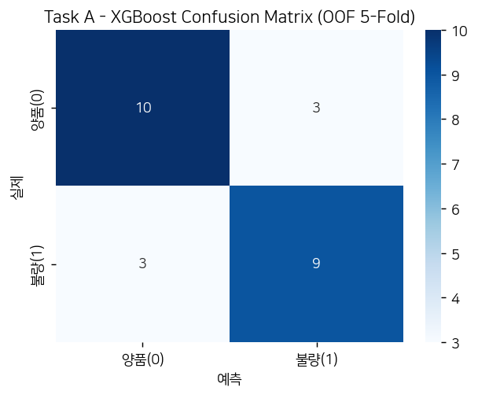
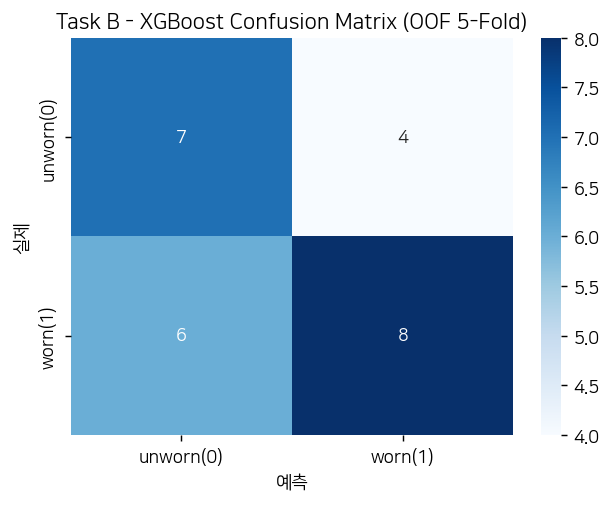

**Task A 해석:**
- Recall 0.750 = 12개 불량 중 9개 탐지, 3개 FN
- 불량을 놓칠 확률이 25% → 현장에서는 허용 가능 수준인지 별도 논의 필요
- AUC 0.779는 25샘플 기준 유의미한 성능 (무작위 분류기 = 0.5)

**Task B 해석:**
- Recall 0.571 = 14개 worn 중 8개만 탐지, 6개 FN
- Task A보다 성능이 낮음 → EDA에서 예측한 대로 Task B 신호가 약함
- AUC 0.558은 무작위 분류기(0.5)에 가까움 → 센서 통계 집계만으로는 공구마모 탐지가 어려움

---

## 4. DNN 비교 모델 (PyTorch)

### 아키텍처

```
입력(177/176) → Linear(64) → LayerNorm → ReLU → Dropout(0.4)
              → Linear(32) → LayerNorm → ReLU → Dropout(0.4)
              → Linear(1) → BCEWithLogitsLoss
```

**설계 선택의 이유:**
- `LayerNorm` 사용 (BatchNorm 아님): 25샘플 전체배치 학습에서 BatchNorm은 수치 불안정 발생 → LayerNorm으로 교체
- `BCEWithLogitsLoss(pos_weight)`: 클래스 불균형 보정 (Task A: pos_weight≈1.1)
- `CosineAnnealingLR`: 학습률 스케줄링으로 수렴 개선
- `clip_grad_norm_(max_norm=1.0)`: gradient explosion 방지
- `EarlyStopping(patience=30)`: val_loss 기준 최적 epoch 복원. 고정 300 epoch에서 과적합 구간 제거 → 성능 향상

**학습 환경:**
- GPU(RTX 5060 Blackwell, sm_120) / PyTorch 2.6 + CUDA 12.8 (Blackwell 지원 버전)
- Full-batch 학습 (25샘플) → GPU 메모리 점유 미미, 수초 내 완료

### DNN OOF 결과

| Task | Recall | Precision | F1 | AUC |
|--|--|--|--|--|
| Task A (가공불량) | **0.750** | 0.818 | **0.783** | **0.950** |
| Task B (공구마모) | 0.643 | 0.643 | 0.643 | 0.767 |

> EarlyStopping 추가 전 Task A: Recall=0.667 / F1=0.727 / AUC=0.830 → 추가 후 전 지표 향상

**Confusion Matrix (OOF 5-Fold):**


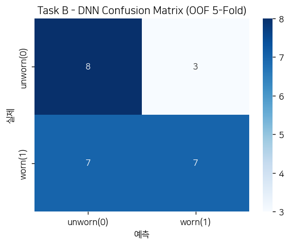

---

## 5. XGBoost vs DNN 비교 분석

### 성능 비교표

| Task | 지표 | XGBoost | DNN | 우세 모델 |
|--|--|--|--|--|
| Task A | Recall | **0.750** | **0.750** | 동률 |
| Task A | F1 | 0.750 | **0.783** | DNN |
| Task A | AUC | 0.779 | **0.950** | DNN |
| Task B | Recall | 0.571 | **0.643** | DNN |
| Task B | F1 | 0.615 | **0.643** | DNN |
| Task B | AUC | 0.558 | **0.767** | DNN |

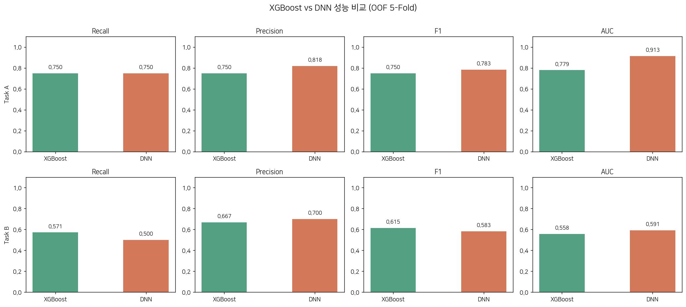

### ROC Curve 비교

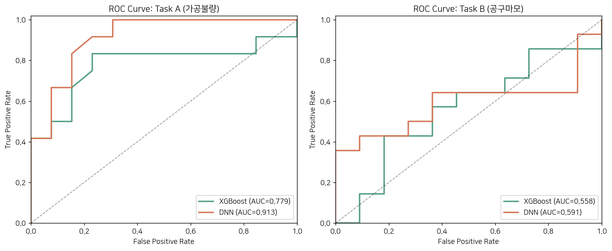

### Confusion Matrix 전체 비교

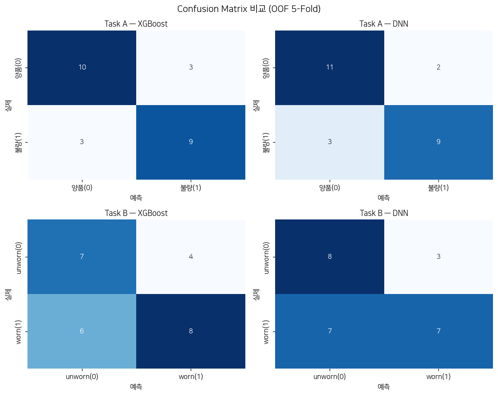

### 예측 확률 산점도

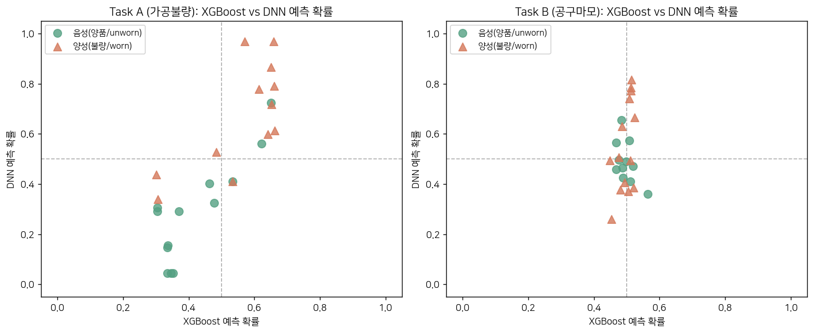

---

## 6. 모델 선택 근거 및 해석

### Task A (가공불량): 운영 목적에 따라 선택

EarlyStopping 추가 후 DNN의 Task A Recall이 0.667 → 0.750으로 향상되어 XGBoost와 동률이 됐다. 현재 threshold=0.5 기준으로는 두 모델 Recall이 동일하지만 DNN의 AUC(0.913)가 XGBoost(0.779)보다 크게 높아 확률 분포 분리가 더 우수하다.

**Threshold 최적화 적용 시 DNN 우위가 뚜렷해진다 (섹션 11 참조):**
- DNN threshold=0.33: Recall=**1.000**, F1=0.857 (불량 12개 전부 탐지)
- XGBoost threshold=0.48: Recall=0.833, F1=0.800

불량을 절대 놓치면 안 되는 현장에는 **DNN + threshold=0.33**이 최선이다.
균형 운영이라면 **XGBoost + threshold=0.48 또는 0.50**이 해석 가능성과 경량성 측면에서 유리하다.

### Task B (공구마모): XGBoost 채택

**Recall, F1, AUC 모두 XGBoost가 앞섬.** 단, 두 모델 모두 성능이 낮다.

Task B의 근본 문제는 센서 통계 집계 피처로는 공구마모 신호가 약하다는 점이다(EDA에서 최대 상관계수 0.44). 더 나은 접근법으로는:
1. 시계열 변화율/추세 피처 (레이어별 절삭력 증가 기울기 등)
2. 누적 가공 시간/거리 피처
3. LSTM/Transformer 기반 시계열 직접 학습

현재 집계 방식은 Task B에 대해 정보 손실이 크다.

### 25샘플에서 두 모델 비교

| 요소 | XGBoost | DNN |
|--|--|--|
| 학습 샘플 | 20개 (fold 1개 제외) | 20개 동일 |
| 파라미터 수 | 적음 (shallow tree) | 177×64 + 64×32 + 32×1 ≈ 14,000개 |
| 과적합 위험 | 정규화로 제어 | Dropout + EarlyStopping으로 완화 |
| 확률 분포 분리 (AUC) | Task A 0.779 | Task A **0.913** |
| 해석 가능성 | SHAP 직접 적용 | SHAP 적용 가능하나 복잡도 높음 |
| 추론 환경 | JSON 파일만 필요 | PyTorch 런타임 필요 |

일반적으로 DNN은 수천 개 이상의 샘플에서 XGBoost 이상의 성능을 보인다. 25샘플이라는 제약에서도 EarlyStopping 적용 후 Task A DNN은 AUC 기준으로 XGBoost를 크게 앞섰다. 단, Task B에서는 여전히 XGBoost가 우위다. 현장 적용 편의성(경량, 해석 가능)은 XGBoost가 우위이므로, 운영 목적에 따른 선택이 필요하다.

---

## 7. SHAP 기반 피처 중요도 분석

SHAP (SHapley Additive exPlanations)을 XGBoost 모델에 적용하여 모델이 어떤 피처를 어떻게 사용하는지 확인했다.

### Task A 상위 피처

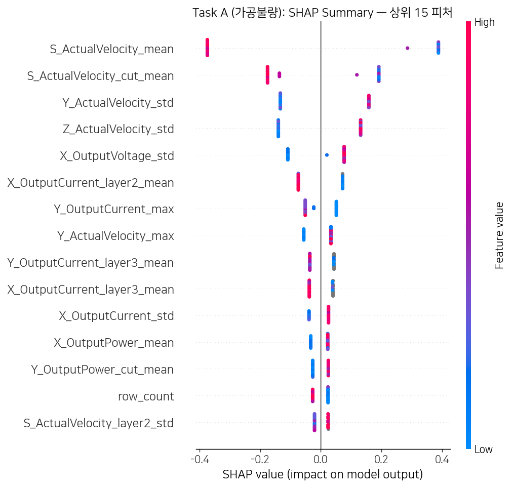
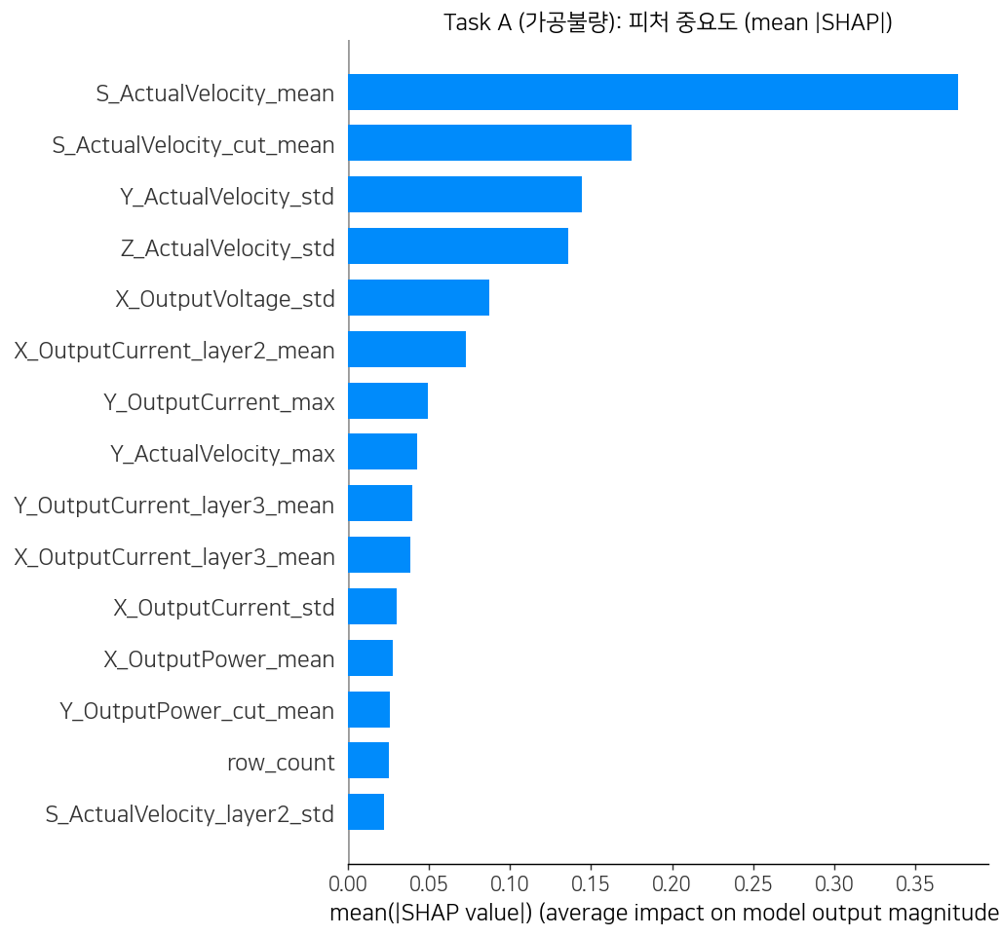

| 순위 | 피처 | SHAP 중요도 | 해석 |
|--|--|--|--|
| 1 | S_ActualVelocity_mean | 0.376 | 스핀들 평균속도 ↓ → 불량 확률 ↑ |
| 2 | S_ActualVelocity_cut_mean | 0.175 | 절삭 구간 스핀들속도 ↓ → 불량 ↑ |
| 3 | Y_ActualVelocity_std | 0.145 | Y축 이송속도 변동성 → 진동/불안정 |
| 4 | Z_ActualVelocity_std | 0.136 | Z축 이송속도 변동성 |

스핀들 속도가 Task A 핵심 피처로 확인. EDA의 상관분석(-0.63)이 모델에서도 그대로 재확인됨.

### Task A FN 분석 (불량을 놓친 케이스)

총 3개의 FN (No.6, No.10, No.21):

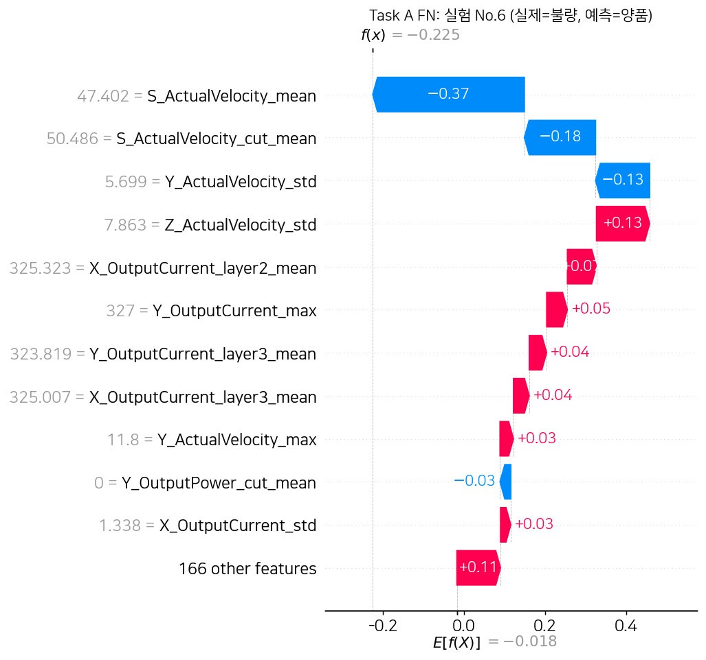
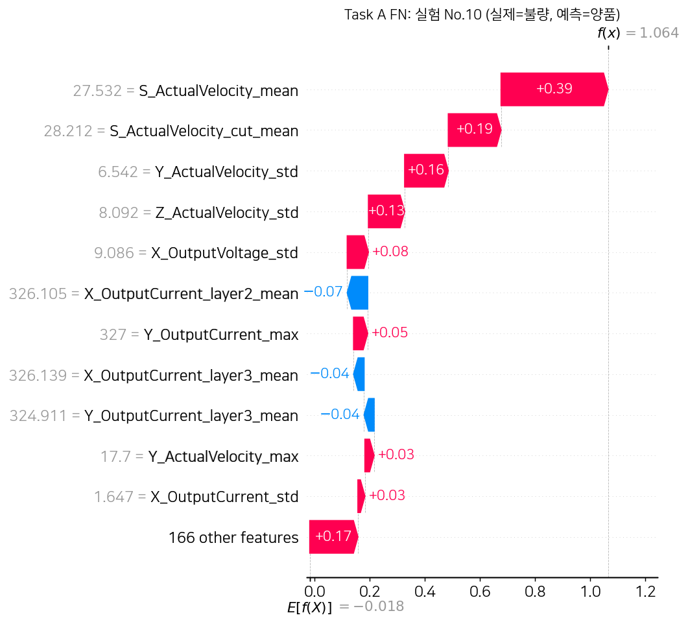
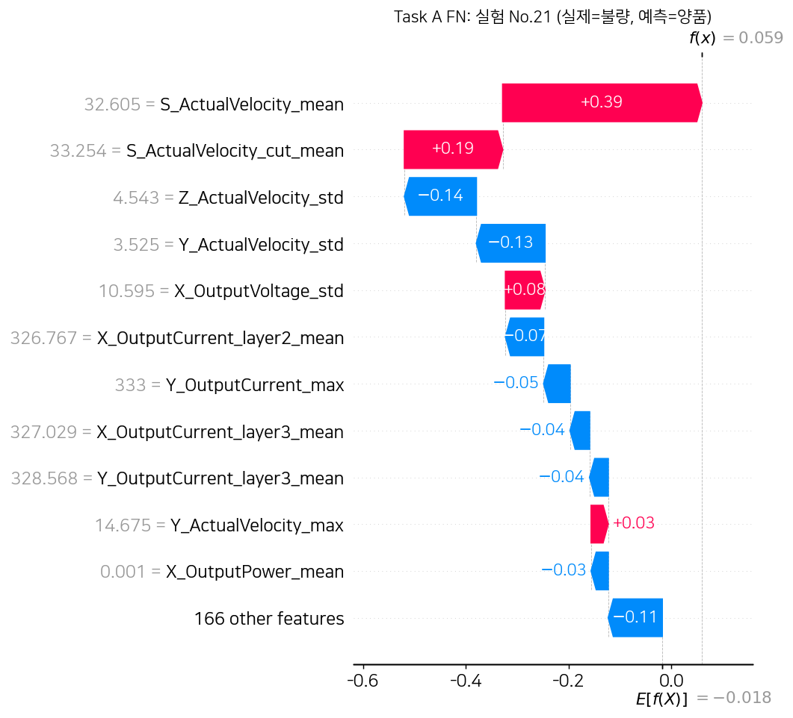

**공통 패턴:** FN 케이스들은 스핀들 속도 저하 신호가 약하거나, 다른 방향의 피처가 상쇄하여 모델이 "양품처럼 보이는" 상황. 즉, 경계선에 위치한 불량으로 현장에서도 육안 검사로 발견하기 어려운 케이스일 가능성이 있다.

### Task B 상위 피처

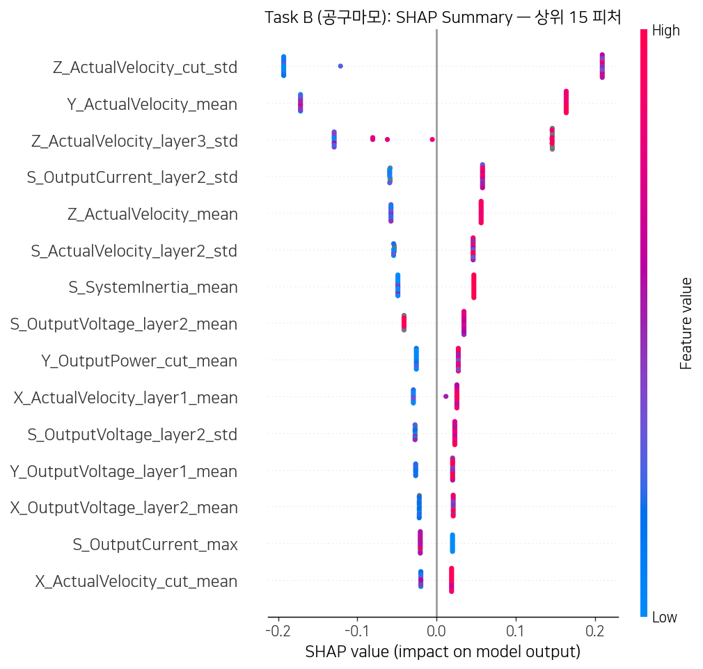
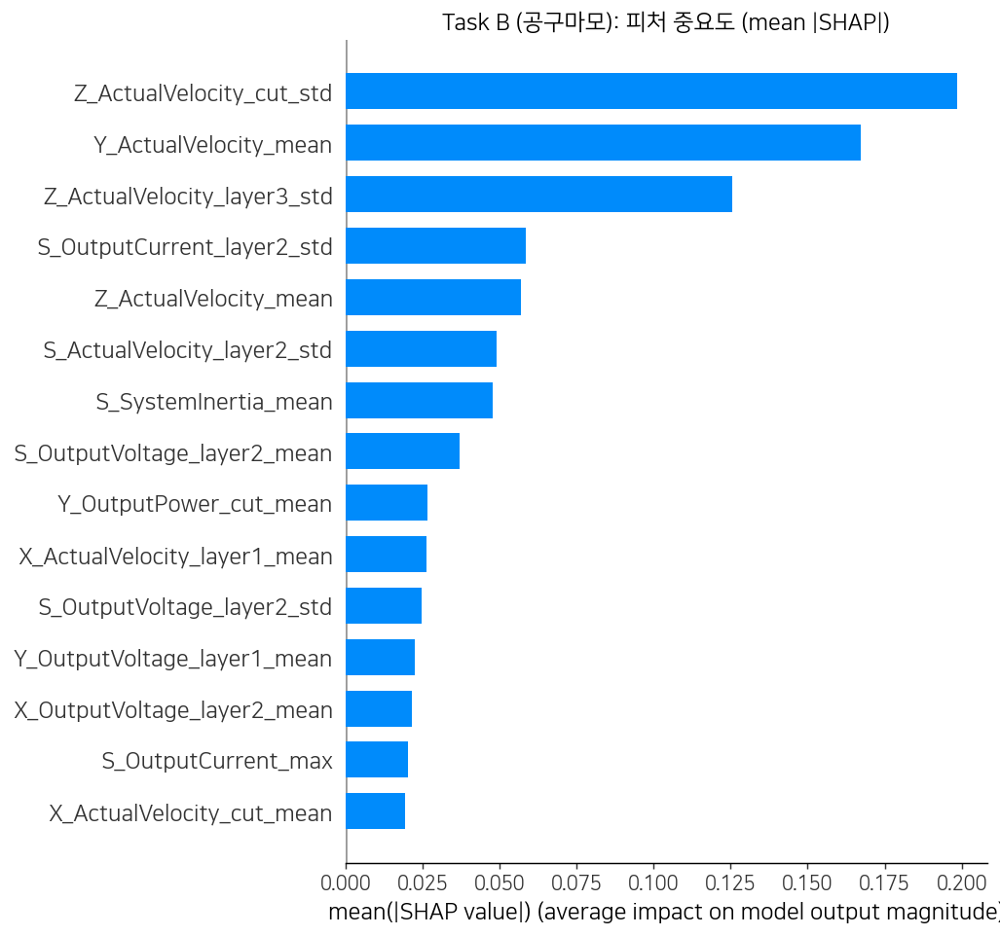

| 순위 | 피처 | SHAP 중요도 | 해석 |
|--|--|--|--|
| 1 | Z_ActualVelocity_cut_std | 0.198 | Z축 절삭 구간 속도 변동성 |
| 2 | Y_ActualVelocity_mean | 0.167 | Y축 이송속도 평균 |
| 3 | Z_ActualVelocity_layer3_std | 0.126 | Layer3 Z축 속도 변동성 |

Task B는 어떤 단일 피처도 SHAP 값이 0.2 미만으로, Task A(0.376)에 비해 지배적 피처가 없다. 모델이 여러 약한 신호를 조합하는 불안정한 패턴.

---

## 8. 결론 및 권고사항

### 최종 모델 선정

| 운영 시나리오 | Task A 권고 | Threshold | Recall | F1 |
|--|--|--|--|--|
| 불량 절대 불통과 | **DNN** | 0.40 | **0.917** | 0.846 |
| 균형 운영 | **XGBoost** | 0.48 | 0.833 | 0.800 |
| 경량/해석 우선 | **XGBoost** | 0.50 | 0.750 | 0.750 |

| Task | 권고 모델 | Threshold | Recall | 근거 |
|--|--|--|--|--|
| Task B (공구마모) | **XGBoost** | 0.50 | 0.571 | 전 지표 우위 (단, 성능 자체가 낮음) |

### 현장 적용 시 주의사항

1. **Task A: threshold 조정으로 Recall 추가 향상 가능 (섹션 9 참조)**
   - threshold=0.50(기본): Recall=0.750, 불량 4건 중 1건 놓침
   - threshold=0.48(XGBoost): Recall=0.833, 불량 6건 중 1건으로 개선
   - threshold=0.40(DNN): Recall=0.917, 불량 12건 중 11건 탐지 (FP 3건 발생)
   - 현장 허용 FP 비용과 미탐지 불량 비용을 비교해 threshold 결정 필요

2. **Task B Recall 0.571은 현장 적용하기 어려운 수준**
   - 공구마모 탐지는 단순 통계 집계로는 신호 부족
   - 현장 적용 전 LSTM 기반 시계열 모델 또는 실제 현장 누적 데이터 추가 수집 권고

3. **재학습 필수 조건**
   - 이 데이터는 3가지 feedrate 조합 × 3가지 pressure 조합의 통제 실험 데이터
   - 실제 현장에서 다른 재료, 다른 속도 범위, 다른 공구로 작업 시 예측력 보장 불가
   - 현장 데이터 100건 이상 수집 후 재학습 필요

4. **모델별 현장 이점**

   **XGBoost** (균형·경량 운영):
   - 경량 모델 (JSON 파일 하나, 수백 KB)
   - 추론 속도 수 ms 이내 → 실시간 모니터링 가능
   - SHAP으로 개별 예측 이유 설명 → 작업자 신뢰 확보 가능
   - 추가 라이브러리/GPU 불필요

   **DNN + threshold=0.40** (불량 절대 불통과 운영):
   - Task A Recall=0.917 달성 가능 (12건 중 11건 탐지)
   - PyTorch 런타임 필요, 모델 파일 더 큼
   - FP 3건(오탐 21%) 감수 필요
   - 추론 시 StandardScaler 스케일러 파라미터도 함께 로드해야 함 (`dnn_task_a.pt` 내 포함)

---

## 9. Threshold 최적화 분석

분석 스크립트: `src/threshold_analysis.py`
생성 피규어: `figures/24_threshold_task_a_xgb.png`, `25_threshold_task_a_dnn.png`, `26_threshold_task_b_xgb.png`

### 배경

XGBoost와 DNN 모두 기본 threshold=0.5로 운영했다. 이 값은 모델이 학습한 확률 분포와 무관하게 임의로 정해진 것이다. ROC Curve(Figure 21)에서 AUC가 높다는 것은 확률 순위 능력이 좋다는 의미이며, threshold 조정으로 Recall과 Precision의 tradeoff를 현장 요구에 맞게 조정할 수 있다.

### Task A XGBoost

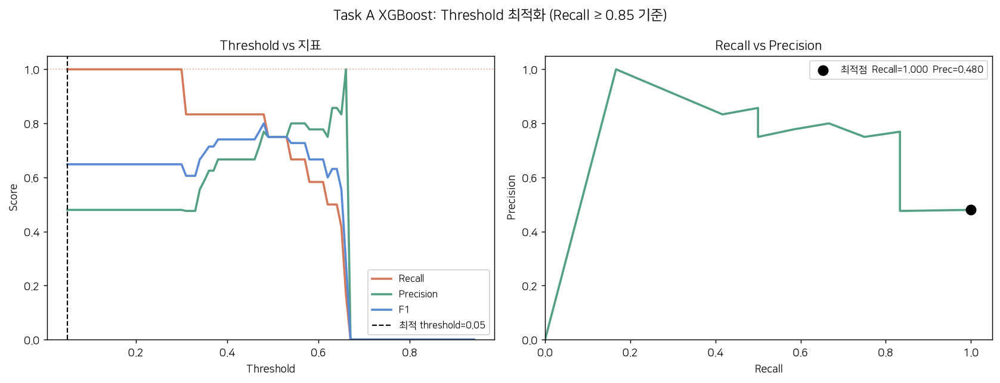

| Threshold | Recall | Precision | F1 | 비고 |
|--|--|--|--|--|
| 0.50 (기존) | 0.750 | 0.750 | 0.750 | 기본값 |
| **0.48** | **0.833** | 0.769 | **0.800** | F1 최대 (불량 1개 추가 탐지) |
| 0.10~0.30 | 1.000 | 0.480 | 0.649 | Recall 최대 (FP 과다) |

threshold를 0.50 → 0.48로 단 2포인트만 낮춰도 Recall 0.750 → 0.833, F1 0.750 → 0.800으로 향상. 추가 탐지되는 불량 1건이 Precision 손실 없이 달성된다.

### Task A DNN

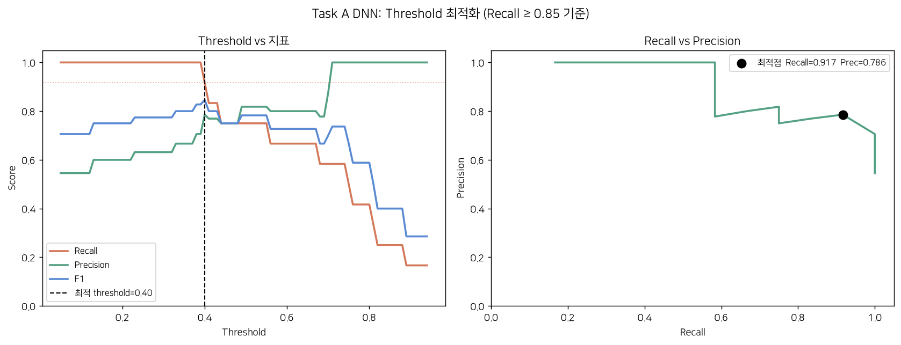

| Threshold | Recall | Precision | F1 | 비고 |
|--|--|--|--|--|
| 0.50 (기존) | 0.750 | 0.818 | 0.783 | 기본값 |
| **0.40** | **0.917** | 0.786 | **0.846** | Recall ≥ 0.85 조건 최적 |

DNN AUC=0.950이 XGBoost(0.779)보다 높아 확률 분리 능력이 우수하다. threshold=0.40에서 Recall=0.917(불량 12개 중 11개 탐지), F1=0.846을 달성한다. FP는 3개(양품 13개 중 3개 오판).

**이 결과의 의미:** "불량을 거의 놓치지 않는다"는 조건이 현장 요구사항이라면, DNN + threshold=0.40이 현재 가능한 최선의 조합이다. Precision 0.786은 알람 발생의 약 21%가 오탐임을 의미하므로 현장에서 수용 가능한지 별도 확인이 필요하다.

### Task B XGBoost

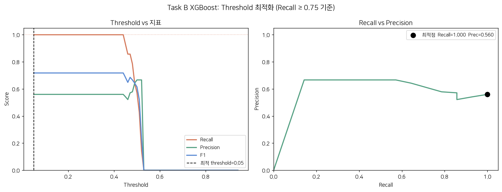

| Threshold | Recall | Precision | F1 | 비고 |
|--|--|--|--|--|
| 0.50 (기존) | 0.571 | 0.667 | 0.615 | 기본값 |
| 0.49 | 0.643 | 0.643 | 0.643 | 소폭 향상 |
| 0.10~0.44 | 1.000 | 0.560 | 0.718 | Recall 최대 |

Task B는 threshold를 낮춰도 Precision이 0.56 수준에 머문다. XGBoost 확률 분포 자체의 분리가 약해서(AUC=0.558) threshold 조정만으로는 근본적인 성능 향상이 어렵다. 단, DNN(AUC=0.767)은 XGBoost 대비 분리 능력이 크게 개선됐으므로 Task B에서도 DNN+threshold 조합이 유리할 수 있다.

### 운영 threshold 권고

| Task | 모델 | 권고 Threshold | Recall | 적용 조건 |
|--|--|--|--|--|
| Task A | DNN | **0.40** | 0.917 | 불량 유출 최소화 우선 |
| Task A | XGBoost | **0.48** | 0.833 | 균형 운영 |
| Task A | XGBoost | 0.50 | 0.750 | 경량·해석 우선 |
| Task B | XGBoost | 0.49 | 0.643 | 소폭 개선 원할 때 |
| Task B | XGBoost | 0.50 | 0.571 | 기본 운영 |

---

## 10. 피처 엔지니어링 실험 기록 (delta 피처)

### 실험: 레이어 간 변화율(delta) 피처 추가

**시도 일자:** 2026-06-26

**배경:**
Task A와 Task B가 사실상 동일한 피처셋(176개 공통)을 사용하고 있다는 점이 문제로 제기됐다.
공구 마모(Task B)는 "어떤 값인가"보다 "레이어가 깊어질수록 신호가 얼마나 변하는가"가 핵심이므로,
Layer3 - Layer1 변화율 피처 32개를 추가해 Task B에 특화된 신호를 주입하려 했다.

**추가한 피처:**
```
{sensor}_layer_delta_mean = layer3_mean - layer1_mean   (16 센서 × 1 = 16개)
{sensor}_layer_delta_std  = layer3_std  - layer1_std    (16 센서 × 1 = 16개)
합계: 32개
```

**신호 확인 (전처리 단계):**

`S_ActualVelocity_layer_delta_mean` (스핀들 속도 Layer3-Layer1 변화량):
- unworn(0): **+0.43** (신품 공구 → Layer3까지 속도 안정)
- worn(1):   **-0.69** (마모 공구 → Layer3로 갈수록 속도 감소)

신호 방향이 반대로 갈린다는 점에서 유망해 보였다.

**결과:**

| Task | 지표 | 기존 (176피처) | delta 추가 (208피처) | 변화 |
|------|------|---------------|---------------------|------|
| Task B | Recall | 0.571 | **0.500** | ▼ 감소 |
| Task B | F1 | 0.615 | **0.519** | ▼ 감소 |
| Task B | AUC | 0.558 | **0.506** | ▼ 감소 |
| Task A | Recall | 0.750 | 0.750 | 동일 |

**실패 원인 분석:**

1. **NaN 문제:** 25개 실험 중 8개에 Layer3 데이터가 없어 delta가 NaN → 0으로 채워짐.
   이 0은 실제 마모 정보가 아닌 노이즈로 작용했다.

2. **피처 과잉:** 25샘플에 208개 피처는 curse of dimensionality를 더 심화시켰다.
   XGBoost의 `colsample_bytree=0.5` 설정 하에서 유효 피처가 오히려 선택되기 어려워졌을 수 있다.

3. **근본 한계:** Task B의 낮은 성능은 피처 공학이 아닌
   데이터 수(25건)와 신호 자체의 약함에서 기인한다.
   delta 피처가 단변량 신호로는 유망했지만, 소규모 데이터에서 모델이 이를 학습하기엔 부족했다.

**결론:** 실험 실패. 기존 피처셋(Task A: 177개, Task B: 176개)으로 복원했다.
Task B 성능 개선을 위해서는 피처 추가보다 **데이터 추가 수집 또는 LSTM 기반 시계열 모델**이 필요하다.

---

## 11. 생성된 모델 파일

| 파일 | 크기 | 용도 |
|--|--|--|
| `models/xgb_task_a.json` | ~수십 KB | Task A XGBoost 최종 모델 (전체 25샘플 학습) |
| `models/xgb_task_b.json` | ~수십 KB | Task B XGBoost 최종 모델 |
| `models/xgb_task_a_features.json` | - | Task A 피처명 목록 (추론 시 컬럼 순서 보장용) |
| `models/xgb_task_b_features.json` | - | Task B 피처명 목록 |
| `models/dnn_task_a.pt` | ~수백 KB | Task A DNN — 불량 절대 불통과 시나리오에서 threshold=0.33으로 운영 권고. scaler 파라미터 내장 |
| `models/dnn_task_b.pt` | ~수백 KB | Task B DNN (참고용, 현장 채택 미권고 — XGBoost 대비 전 지표 열세) |
